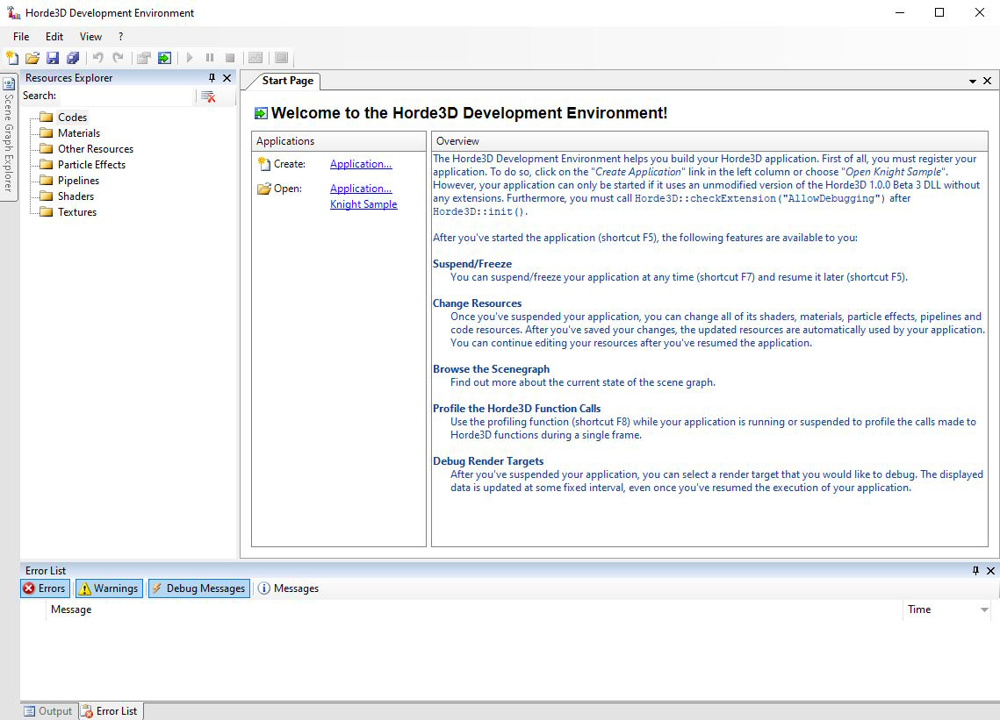
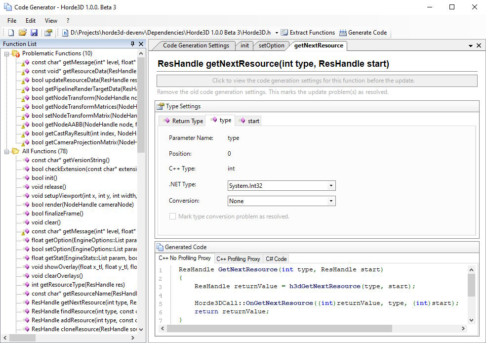

# Horde3D Development Environment

This repo contains the source code of the project I developed for my bachelor's thesis in 2009, as well as the [bachelor's thesis (in German)](/Documentation/LaTeX/Bachelorarbeit.pdf) itself.

## Bachelor Thesis Abstract

The costs of content creation significantly determine the overall development costs of video games today.
In addition to textures, 3D models, and sound effects, shader and particle-based special effects also have a significant impact on the quality of a game.
Such special effects are supported by the rendering pipeline of the [Horde3D](https://github.com/horde3d/Horde3D) 3D rendering and animation engine.
However, the configuration of the pipeline is XML-based, and the engine does not provide tools to facilitate the development, testing, and optimization of effects.

The goal of this bachelor thesis is to design and implement a shader and special effects management system that makes the customization and optimization of effects easier and faster.

## Technical Details

The code and the thesis were originally written in 2009 in a SVN repo, which has been lost.
Therefore, there is only a single commit in this Git repo.

The UI of the Horde3D Development Environment is implemented in C# using WinForms and some WPF, originally using Visual Studio 2010 and recently updated to Visual Studio 2022.
To take over control of a running Horde3D game, a [DLL injection library](https://github.com/microsoft/Detours) was used.
This injected code is written in C++ and interacts with the C# code through a C++/CLI layer as well as named pipes using WCF.

The thesis is written in LaTex. The architecture and design diagrams were created with Enterprise Architect.

## Screenshots

_The Horde3D Development Environment start page_

_Configuration UI of the code generator for the injected Horde3D API proxy_
